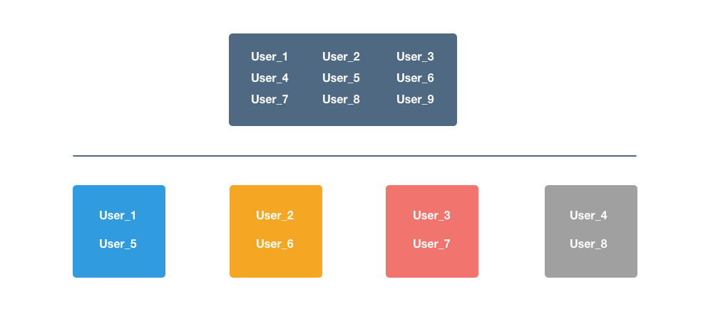

# Sharding a Database

Let's design a sharding scheme for key-value storage.

## Features:

This is the first part of any system design interview, coming up with the features which the system should support. As an interviewee, you should try to list down all the features you can think of which our system should support. Try to spend around 2 minutes for this section in the interview. You can use the notes section alongside to remember what you wrote. 

#### Q: What is the amount of data that we need to store? 

A: Let's assume a few 100 TB.

#### Q: Will the data keep growing over time? If yes, then at what rate?

A: Yes. At the rate of 1TB per day.

#### Q: Can we make assumptions about the storage of machines available with me? 

A: Let's assume that machines have a RAM of 72G and a hard disk capacity of 10TB. 

#### Q: How many machines do I have to begin with? 

A: Let's assume we have 20 machines to begin with. More machines will be available on request if need be. 

#### Q: Are all key value entries independent?

A: Yes. A typical query would ask for value corresponding to a key. 

## Estimation:

This is usually the second part of a design interview, coming up with the estimated numbers of how scalable our system should be. Important parameters to remember for this section is the number of queries per second and the data which the system will be required to handle. Try to spend around 5 minutes for this section in the interview.

Total storage size : 100 TB as estimated earlier 

Storage with every machine : 10TB 

#### Q: What is the minimum number of machines required to store the data? 

A: Assuming a machine has 10TB of hard disk, we would need minimum of 100TB / 10 TB = 10 machines to store the said data. Do note that this is bare minimum. The actual number might be higher. In this case, we have 20 machines at our disposal.

#### Q: How frequently would we need to add machines to our pool ? 

A: The data grows at 1TB per day. That means that we generate data that would fill the storage of 1 machine ( 10TB ) in 10 days. Assuming, we want to keep a storage utilization of less than 80%, we would need to add a new machine every 8 days.

## Deep Dive: 

Lets dig deeper into every component one by one. Discussion for this section will take majority of the interview time(20-30 minutes). 

Note : In questions like these, the interviewer is looking at how you approach designing a solution. So, saying that I’ll use a distributed file system like HDFS is not a valid response. It's okay to discuss the architecture of HDFS with details around how HDFS handles various scenarios internally.

#### Q: Can we have a fixed number of shards?

A: One qualification for a shard is that the data within a shard should fit on a single machine completely. 

As in our case, the data is growing at a fast pace, if we have a fixed number of shards, data within a shard will keep growing and exceed the 10TB mark we have set per machine. Hence, we cannot have a fixed number of shards. The shards will have to increase with time.

#### Q: How many shards do we have and how do we distribute the data within the shard? 

A: Lets say our number of shards is S. One way to shard is that for every key, we calculate a numeric hash H, and assign the key to the shard corresponding to H % S. There is one problem here though. As we discussed earlier, the number of shards will have to increase. And when it does, our new number of shard becomes S+1. As, such H%(S+1) changes for every single key causing us to relocate each and every key in our data store. This is extremely expensive and highly undesirable.

#### Q: Can we think of a better sharding strategy? Hint: Consistent Hashing. 

A: Consistent hashing is ideal for the situation described here. Lets explore consistent hashing here. Let's say we calculate a 64 bit integer hash for every key and map it to a ring. Lets say we start with X shards. Each shard is assigned a position on the ring as well. Each key maps to the first shard on the ring in clockwise direction.

.png>)

What happens if we need to add another shard ? Or what if one of the shard goes down and we need to re-distribute the data among remaining shards?

.png>)

Similarily, there is a problem of cascading failure when a shard goes down.

.png>)

### Modified consistent hashing 

What if we slightly changed the ring so that instead of one copy per shard, now we have multiple copies of the same shard spread over the ring.

.png>)

Case when new shard is added :

.png>)

Case when a shard goes down : No cascading failure. Yay!

.png>)

